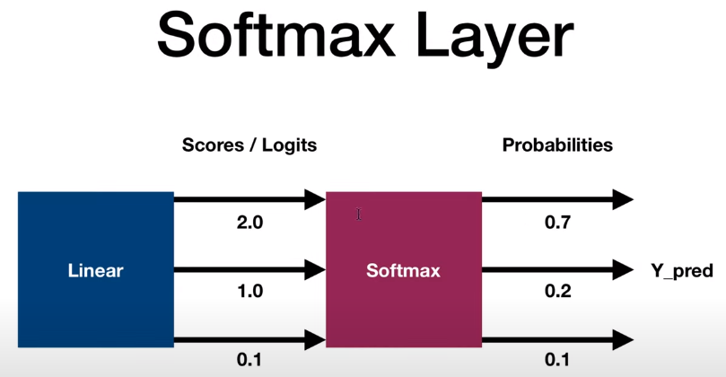
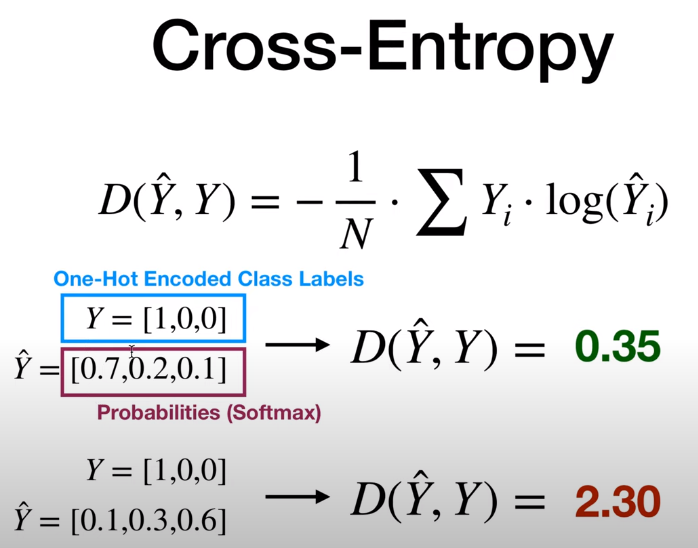

Data Scientist: Dr.Eddy Giusepe Chirinos Isidro

# Softmax and Cross Entropy

Nesta script aprenderemos sobre a função Softmax e a função de Perda de Entropia Cruzada. Softmax e Entropia Cruzada são funções populares usadas em Redes Neurais, especialmente em problemas de Classificação Multiclasse. 

É recomendado fortemente aprender a matemática por trás dessas funções e quando e como usá-las no `Pytorch`. Aprenda também as diferenças entre problemas de Classificação Multiclasse e Binária. 

## Softmax

$$S(y_i) = \frac{e^{y_i}}{\sum e^{y_i}}$$

O que faz basicamente é esmagar a saída a ser entre $0$ e $1$.

## Cross-Entropy

